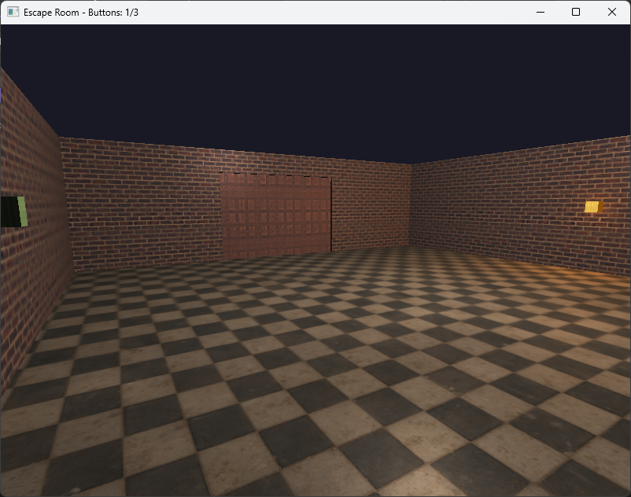

# GAM531 Midterm - Escape Room

A 3D first-person escape room puzzle game built with OpenTK and C#.

## Description

In this game, you navigate through a textured 3D room where you must locate and press three buttons to open the locked door. The game features dynamic lighting effects: buttons glow orange when activated, and the door illuminates once all buttons are pressed. Use the first-person controls to explore and interact with the environment.

## Gameplay

### Controls
- `W/A/S/D` - Move forward/left/backward/right
- `E` - Interact with buttons and door (when near them)
- `Mouse` - Look around (camera control)
- `Mouse Wheel` - Zoom in/out (adjust FOV)
- `Space` - Jump
- `ESC` - Exit game

### Instructions
- Approach buttons and press `E` to activate them
- Once all 3 buttons are activated, the door will unlock
- Approach the unlocked door and press `E` to escape

## Features

- First-person camera system with mouse look and WASD movement
- Jump mechanics with simple gravity physics
- Phong lighting with multiple dynamic point lights
- Textured environment (floor, walls, buttons, door)
- Emissive/glow effects for activated buttons and unlocked door
- Object interaction

## How to Build/Run

### Requirements
- **.NET 8.0 SDK** or higher
- **Visual Studio 2022**

### Dependencies (NuGet Packages)
- `OpenTK` (4.x or higher) - OpenGL bindings and windowing
- `StbImageSharp` - Image loading for textures

### Build Instructions
1. Clone the repo
2. Open the solution/project in Visual Studio
3. Restore NuGet packages (**they should install automatically, but if not**):
	-   Right-click on the solution in Solution Explorer
	-   Select "Restore NuGet Packages"
	-   Or run in terminal: `dotnet restore`
4. Build the solution (Ctrl+Shift+B). If successful, the binary will be located inside the `build` directory
5. Run the application (F5)

## Credits

- **Framework**: OpenTK (Open Toolkit Library)
- **Image Loading**: StbImageSharp
-  **Textures**: 
	-  [Checkered Pavement Tiles](https://polyhaven.com/a/checkered_pavement_tiles) - Poly Haven 
	-  [Wooden Garage Door](https://polyhaven.com/a/wooden_garage_door) - Poly Haven 
	-  [Factory Wall](https://polyhaven.com/a/factory_wall) - Poly Haven 
	-  [Red Brick](https://polyhaven.com/a/red_brick) - Poly Haven
